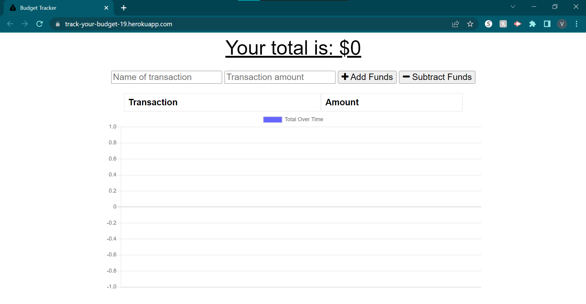

# Budget Tracker Starter Code

## Description: 
This application was created for the user to be able to budget and keep track of their withdrawals and deposits. If the user runs into bad connections to the internet, the user will still be able to use the app in offline mode. When the user is able to get back online, a notification appears letting them know that any data that was sent while offline has synced up into the database.

## Installation
Make sure to install all your dependencies.

## Usage

## Links
link to github project page: https://github.com/va-lopez/19_PWA_track_a_budge
link to deployed application: https://track-your-budget-19.herokuapp.com/